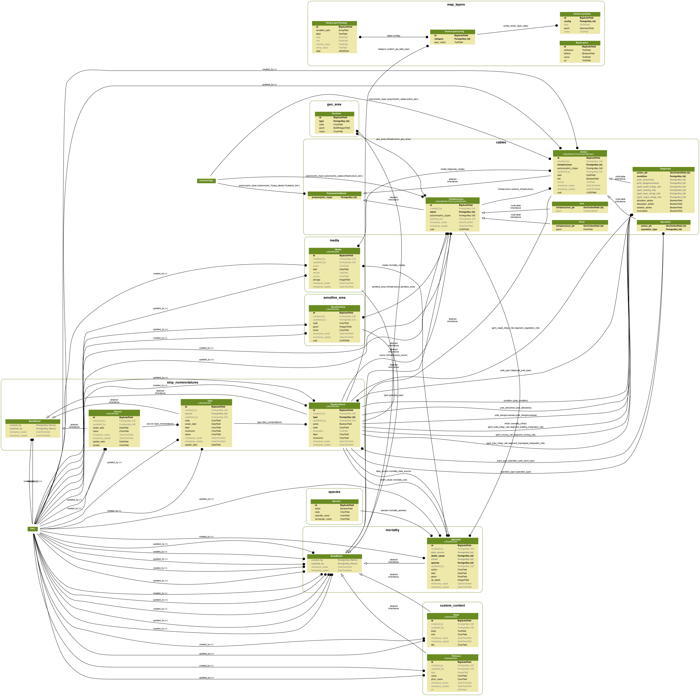

Models
======

Original database model

.. image:: ../images/original_db_model.png
    :alt: Original DB Model

Actual database model

.. image:: ../images/db_model.png
    :alt: Actual DB Model

Actual app model

.. poetry run python -m manage graph_models -g -t original --rankdir RL -o ../docs/source/images/app_models.png cables species mortality custom_content map_layers sensitive_area geo_area media commons sinp_nomenclatures

